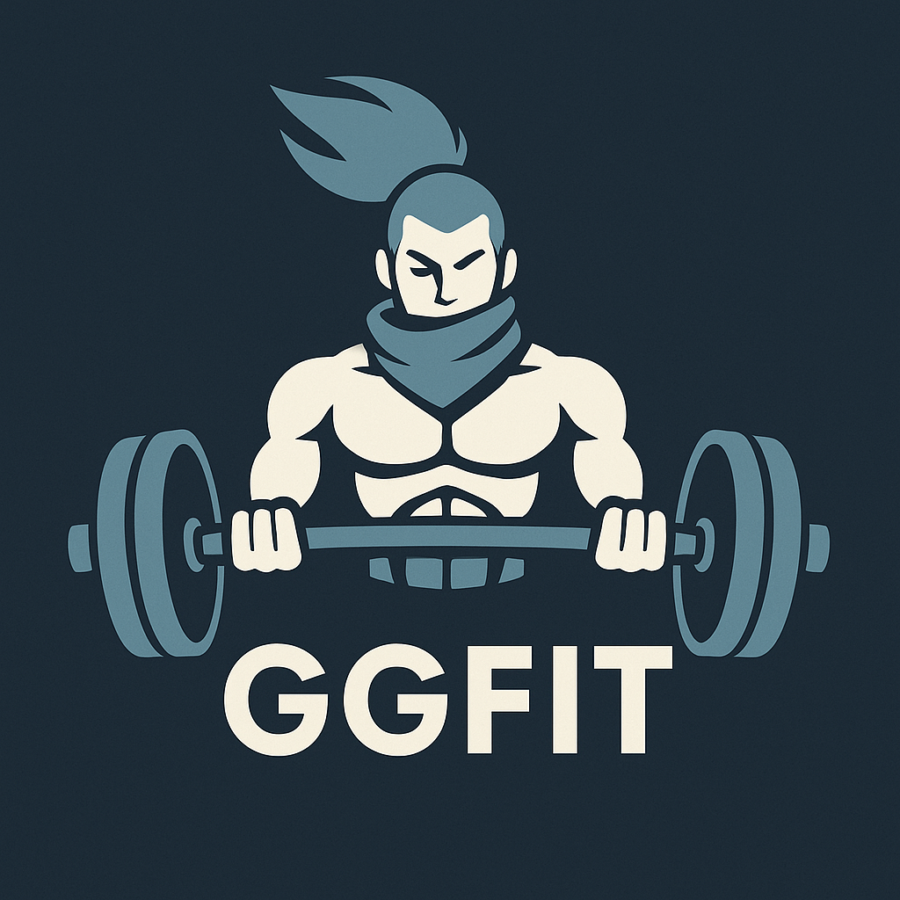

# GGFit



**Web en producción:**  
👉 [https://ggfit-six.vercel.app/](https://ggfit-six.vercel.app/)

---

## ¿Qué es GGFit?

GGFit es una aplicación web que gamifica el fitness usando tus partidas de League of Legends. Analiza tu rendimiento y te asigna ejercicios personalizados para mejorar tu salud mientras juegas.

---

## Logo

El logo oficial de GGFit está disponible en el archivo `public/ggfit.png`.

---

## Uso de la API de Riot

Para poder usar la API de Riot Games de forma legal y segura, debes cumplir estos pasos:

1. **Solicitar una API Key en el portal de desarrolladores de Riot:**  
   - Regístrate en [https://developer.riotgames.com/](https://developer.riotgames.com/)
   - Crea una nueva aplicación y describe tu proyecto (por ejemplo: "Aplicación web de fitness gamificado que motiva a los jugadores de LoL a hacer ejercicio según su rendimiento en partidas").
   - Acepta los términos de uso y la política de Riot.

2. **Requisitos para producción:**  
   - Si tu app va a ser pública, deberás solicitar una **API Key de producción** (la de desarrollo es temporal y limitada).
   - Riot te pedirá información sobre tu proyecto, cómo usas los datos y cómo proteges la clave (por ejemplo, usando un backend proxy y nunca exponiéndola en el frontend).

3. **Buenas prácticas:**  
   - No expongas la API Key en el frontend.
   - Usa variables de entorno y un backend para hacer las peticiones a Riot.
   - Añade en tu README y en la web un aviso de que GGFit no está afiliado ni respaldado por Riot Games.

---

## Aviso legal para Riot

> GGFit no está afiliado ni respaldado por Riot Games, Inc. League of Legends y todos los logotipos relacionados son marcas registradas de Riot Games, Inc.

## Recursos y dependencias principales

- **Supabase**: Backend como servicio para autenticación, base de datos y almacenamiento en la nube. [https://supabase.com/](https://supabase.com/)
- **Chakra UI**: Librería de componentes de UI para React. [https://chakra-ui.com/](https://chakra-ui.com/)
- **react-slick**: Carrusel responsivo para React. [https://react-slick.neostack.com/](https://react-slick.neostack.com/)
- **slick-carousel**: Estilos CSS para react-slick. [https://kenwheeler.github.io/slick/](https://kenwheeler.github.io/slick/)
- **@types/react-slick**: Tipos de TypeScript para react-slick.

## Instalación de dependencias

```bash
npm install @chakra-ui/react @emotion/react @emotion/styled framer-motion
npm install @supabase/supabase-js
npm install react-slick slick-carousel
npm install --save-dev @types/react-slick
```

## Estructura principal
- **/src/pages/Home.tsx**: Pantalla de inicio, incluye carrusel de ejercicios destacados.
- **/src/pages/Exercises.tsx**: Ejercicios diarios, lógica de completado y puntos.
- **/src/pages/Leaderboard.tsx**: Clasificación global de usuarios.
- **/src/supabaseClient.ts**: Configuración de Supabase.

## Notas
- Asegúrate de tener el archivo `riot.txt` en la carpeta `public` si usas la API de Riot.
- Los GIFs de ejercicios deben estar en `public/ejercicios`.

---

Actualiza este README cada vez que añadas nuevas librerías o recursos importantes.
